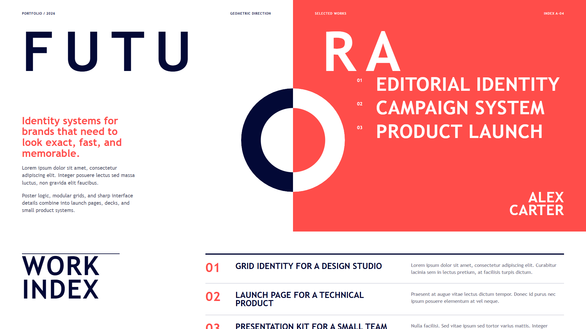
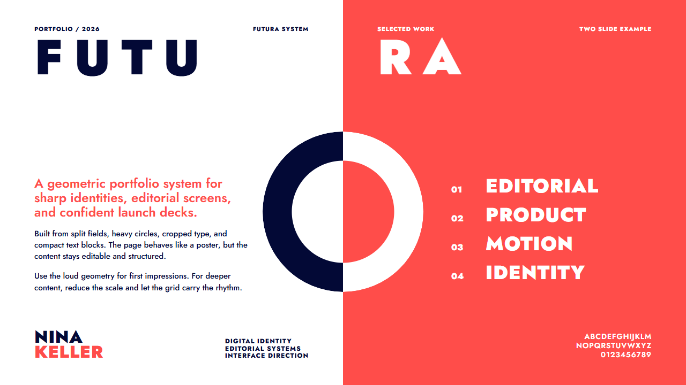
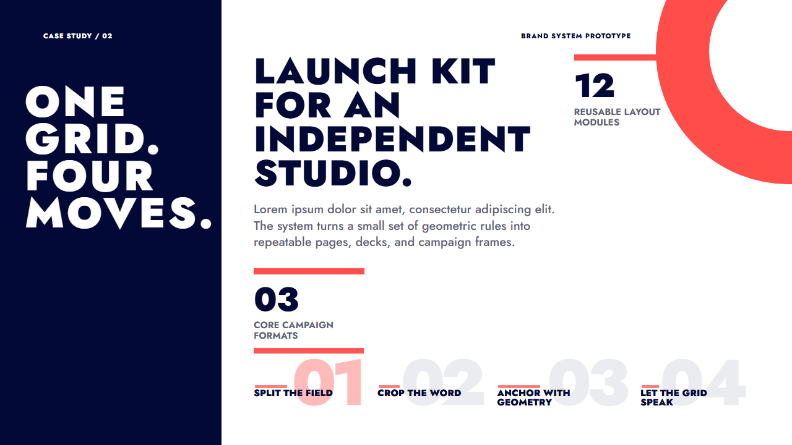
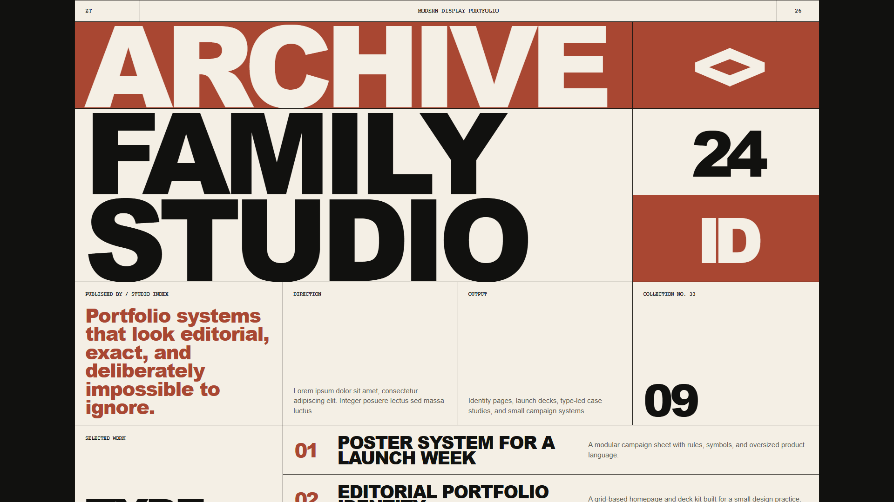
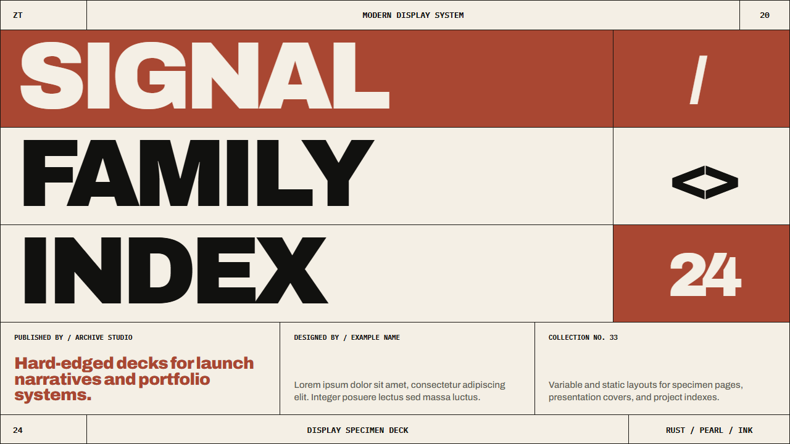
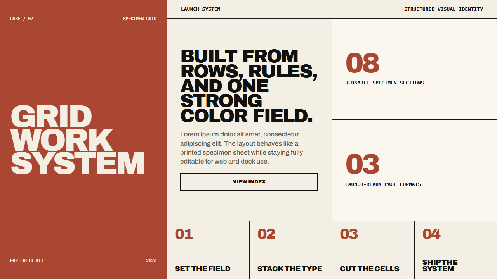
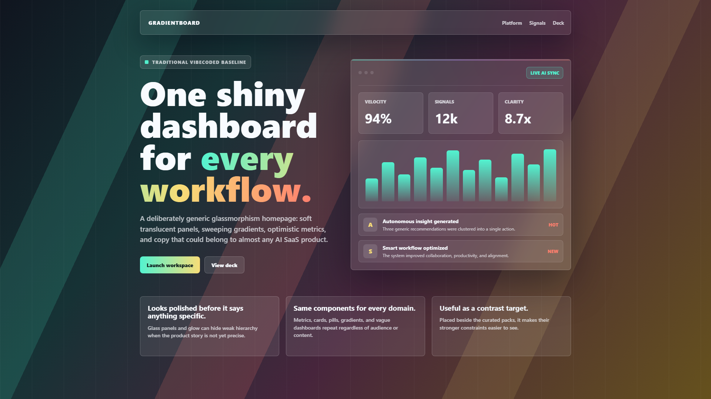
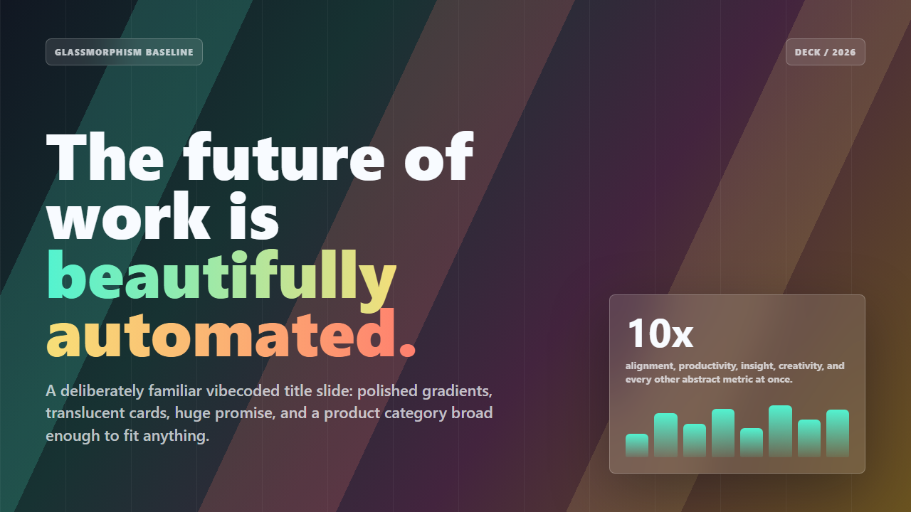
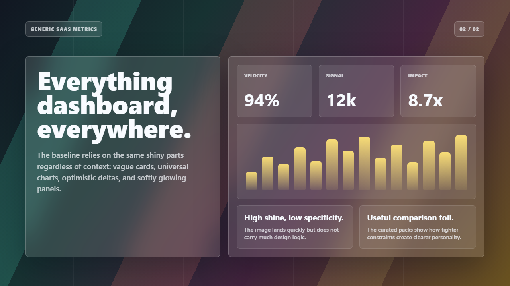

# UI Guide Showcase

This page collects screenshots of each editable homepage and two-slide deck. The `vibecoded-glassmorphism` folder is included as a comparison baseline: it is intentionally generic and does not reuse the curated pack styles.

## Curated Style Packs

| Pack | Homepage | Deck slide 1 | Deck slide 2 |
|---|---|---|---|
| Swiss Grid |  |  |  |
| Futura Bauhaus |  |  |  |
| Modern Display Specimen |  |  |  |
| Chunky Pop Poster |  |  |  |
| UFO Archive Paper |  |  |  |

## Baseline Comparison

| Baseline | Homepage | Deck slide 1 | Deck slide 2 |
|---|---|---|---|
| Vibecoded Glassmorphism |  |  |  |

## What The Comparison Shows

| Dimension | Curated UI Guide packs | Traditional vibecoded glassmorphism |
|---|---|---|
| Visual logic | Each pack has a distinct rule set for type, spacing, composition, and color. | The surface polish comes first; the same cards and gradients can fit almost any project. |
| Content fit | Layout constraints reinforce a specific audience and use case. | Vague metrics and dashboard shapes stand in for product-specific storytelling. |
| Reuse | Copy the pack tokens and examples when the tone matches the assignment. | Use only as a contrast target when explaining why stronger constraints matter. |

