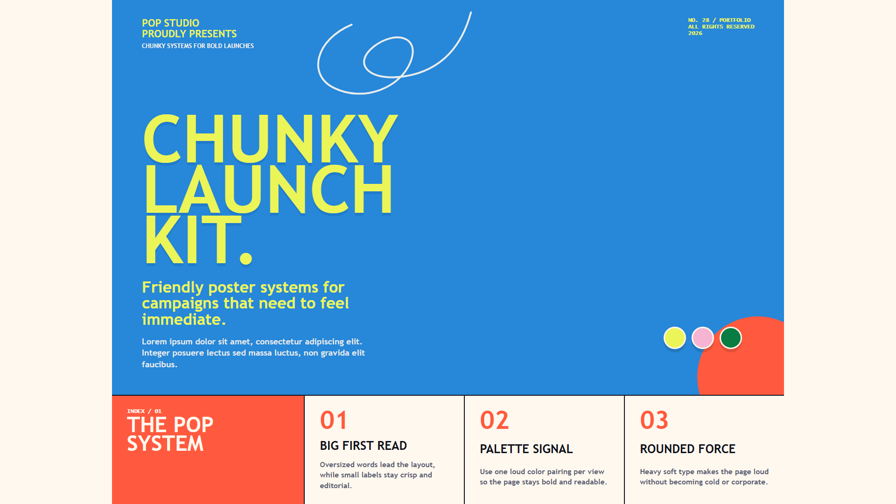
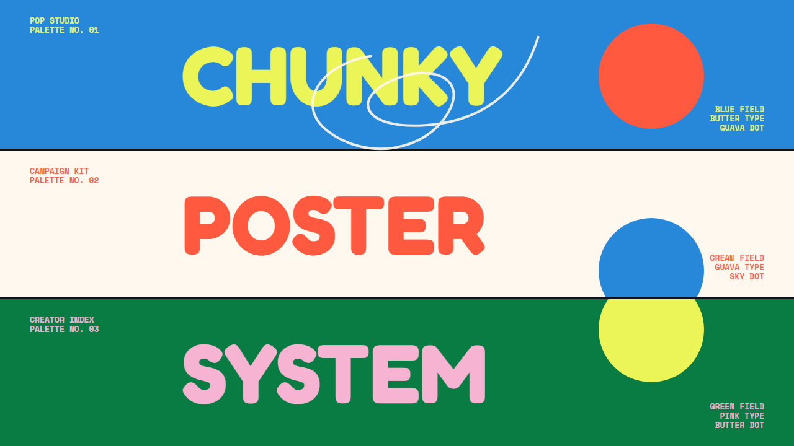
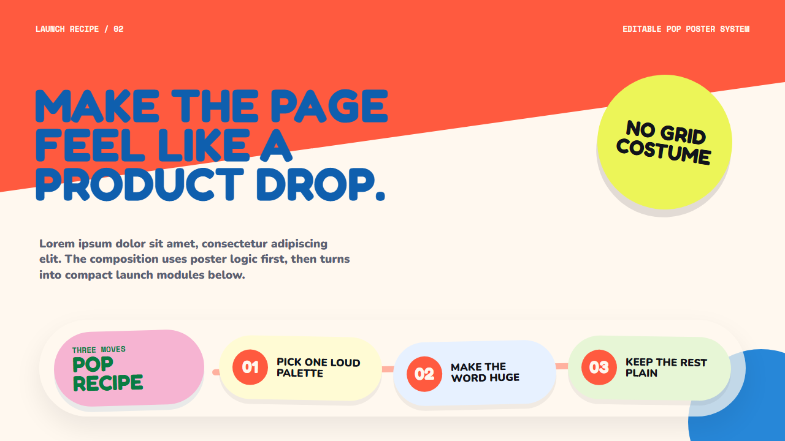

# Chunky Pop Poster UI Guide Pack

This folder contains a compact editable style package inspired by bright retro type posters, chunky rounded display lettering, saturated palette variants, and friendly launch graphics.

## Files

- `styleguide.md` - design system notes for UI and presentation use.
- `tokens.css` - shared CSS tokens and reusable visual primitives.
- `home.html` - short portfolio/launch home page example with placeholder content.
- `example-deck.html` - two-slide presentation example in the Chunky Pop Poster style.

## Preview

Open these files directly in a browser:

- `home.html`
- `example-deck.html`

For the deck, use left and right arrow keys to move between slides. Add `?qa=1` to hide the navigation bar for screenshots. Add `?qa=1&slide=2` to inspect the second slide directly.

## Screenshots

| Homepage | Deck slide 1 | Deck slide 2 |
|---|---|---|
|  |  |  |

## Character

Use this style when the message should feel bold, friendly, playful, and promotional. It is strongest for product drops, creator portfolios, small campaign systems, and expressive presentation openings. It is not intended for dense dashboards or enterprise admin tools.
