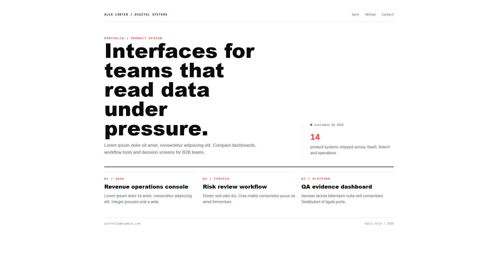
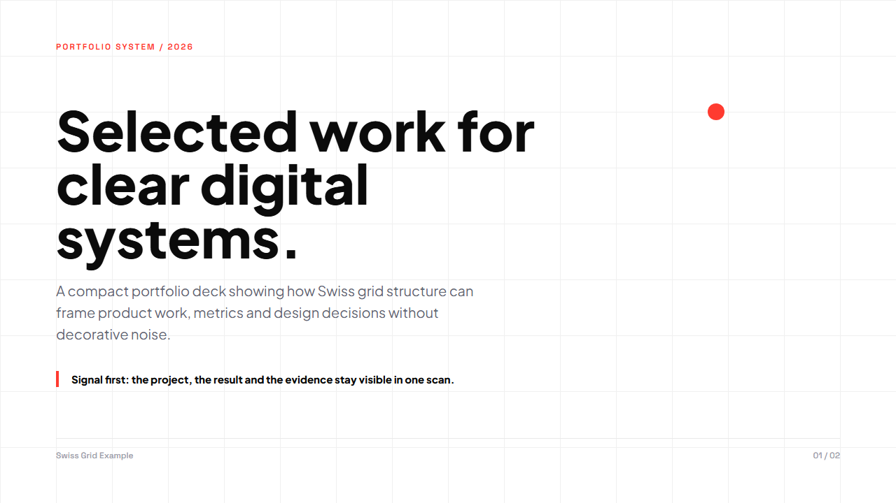
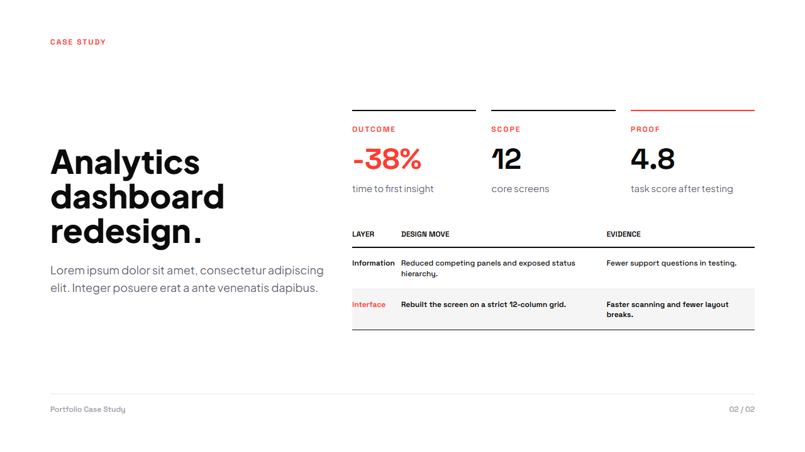

# Swiss Grid UI Guide Pack

This folder contains a compact Swiss Grid style package for UI and presentation work.

## Files

- `styleguide.md` - detailed design system notes for UI and slide decks.
- `tokens.css` - shared CSS tokens and basic reusable components.
- `example-deck.html` - two-slide presentation example in the Swiss Grid style.
- `home.html` - short portfolio home page example with placeholder content.

## Preview

Open these files directly in a browser:

- `example-deck.html`
- `home.html`

For the deck, use left and right arrow keys to move between slides. Add `?qa=1` to hide the navigation bar for screenshots.

## Screenshots

| Homepage | Deck slide 1 | Deck slide 2 |
|---|---|---|
|  |  |  |
