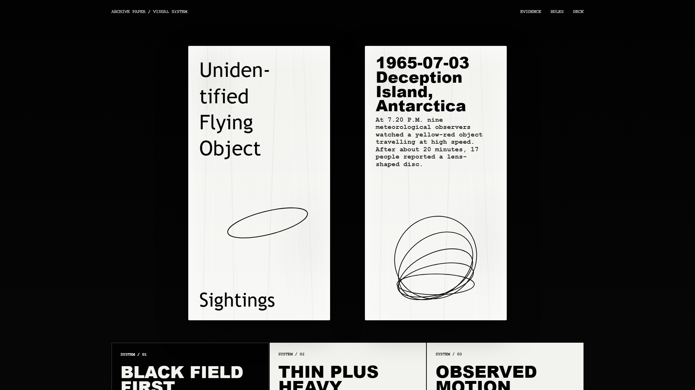
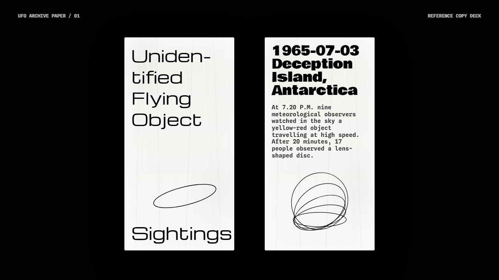
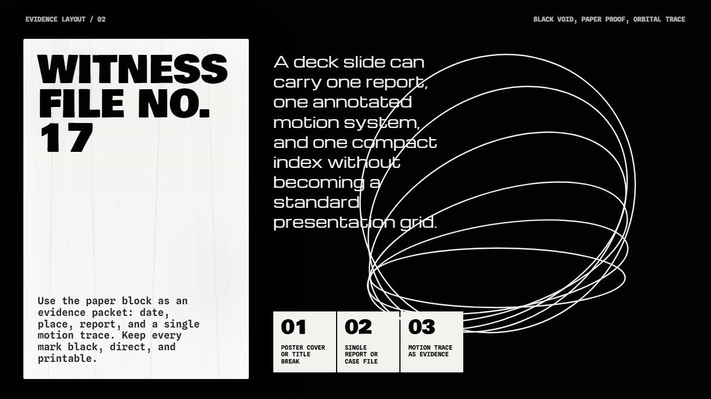

# UFO Archive Paper UI Guide Pack

This folder contains a dark archival poster style package inspired by the supplied unidentified flying object sighting reference.

## Files

- `styleguide.md` - detailed design system notes for UI and slide decks.
- `tokens.css` - shared CSS tokens, page styles, and reusable visual primitives.
- `home.html` - homepage example with two paper poster panels and supporting style notes.
- `example-deck.html` - two-slide presentation example in the UFO Archive Paper style.

## Preview

Open these files directly in a browser:

- `home.html`
- `example-deck.html`

For the deck, use left and right arrow keys to move between slides. Add `?qa=1` to hide the navigation bar for screenshots.

## Screenshots

| Homepage | Deck slide 1 | Deck slide 2 |
|---|---|---|
|  |  |  |
